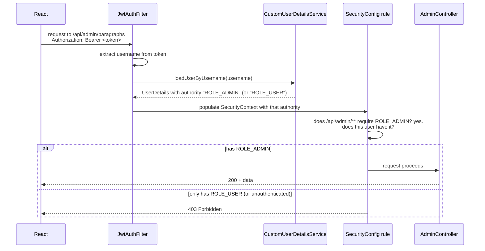
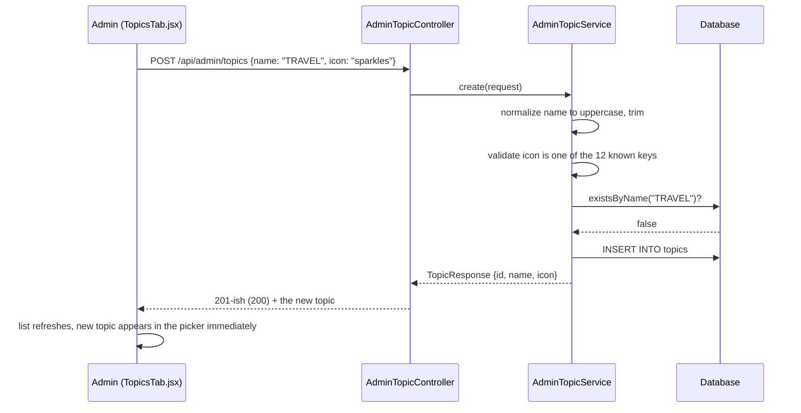
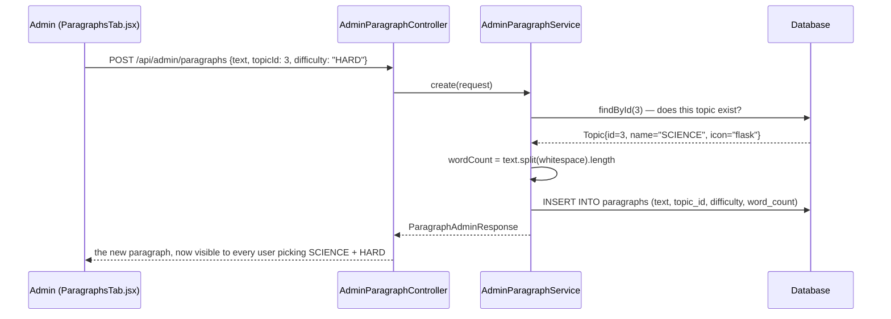
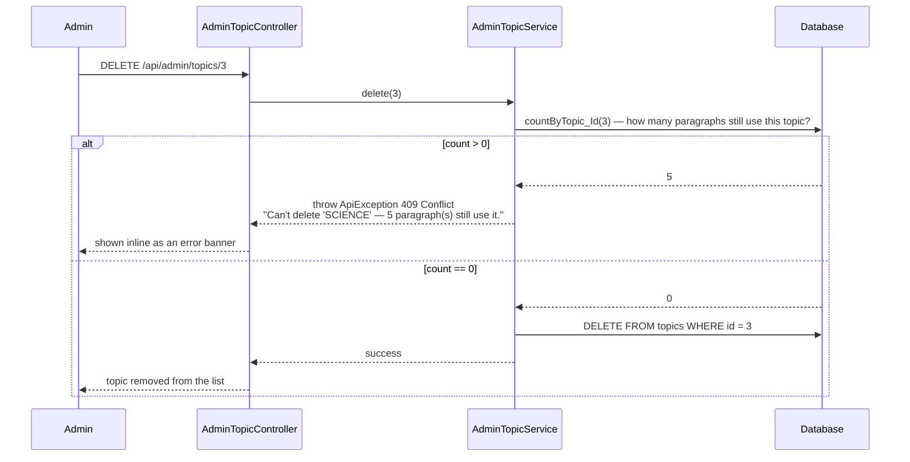

# The Admin Panel — How It Actually Works

This explains the logic behind the admin feature specifically: the role
system, how `Topic` went from a fixed enum to a database table, and exactly
what happens on each admin action. For the rest of the app, see
[ARCHITECTURE.md](./ARCHITECTURE.md).

## Table of contents

1. [What this feature replaces](#1-what-this-feature-replaces)
2. [The role system](#2-the-role-system)
3. [The default admin account](#3-the-default-admin-account)
4. [Topic: from enum to entity](#4-topic-from-enum-to-entity)
5. [Workflow — creating a topic](#5-workflow--creating-a-topic)
6. [Workflow — creating a paragraph](#6-workflow--creating-a-paragraph)
7. [Workflow — deleting a topic (and why it can fail)](#7-workflow--deleting-a-topic-and-why-it-can-fail)
8. [Frontend: how route/UI gating works](#8-frontend-how-routeui-gating-works)
9. [Admin API reference](#9-admin-api-reference)
10. [What's deliberately not built](#10-whats-deliberately-not-built)

---

## 1. What this feature replaces

Previously, adding a new paragraph or topic meant editing `DataSeeder.java`
directly — a Java source file — and restarting the backend. That's fine for
the initial 48 seed paragraphs, but useless for anyone who isn't comfortable
editing Java. The admin panel (`/admin` in the app) replaces that with:

- A `POST`/`PUT`/`DELETE` REST API for both paragraphs and topics
- A UI to drive that API without touching a database client or code
- A **role system**, so only trusted accounts can use it

---

## 2. The role system

There was no concept of "roles" before this feature — every logged-in user
could do the same things. Adding admin-only actions required a real
authorization layer, not just authentication (knowing *who* you are vs.
controlling *what you're allowed to do*).

**The pieces:**

- `model/Role.java` — a plain two-value enum: `USER`, `ADMIN`.
- `User.role` — every user has exactly one. Self-registration
  (`AuthService.register()`) always sets `Role.USER` — there's no way to sign
  up as an admin through the public form, on purpose.
- `CustomUserDetailsService` — this is the piece that actually enforces
  anything. It now builds Spring Security's `UserDetails` with a real
  authority: `new SimpleGrantedAuthority("ROLE_" + user.getRole().name())`.
  Previously this list was empty, so no role check could ever have passed.
- `SecurityConfig` — one line: `.requestMatchers("/api/admin/**").hasRole("ADMIN")`.
  Spring Security's `hasRole("ADMIN")` specifically looks for an authority
  string of `"ROLE_ADMIN"` — that's why the prefix gets added by hand above;
  it's a Spring convention, not something our own `Role` enum needs to know about.



**On the frontend**, the JWT itself doesn't carry the role — decoding JWTs
client-side is unnecessary extra complexity here. Instead, `AuthResponse` (the
JSON returned by login/register) now includes a plain `role` field alongside
`token`/`username`. `AuthContext` stores it the same way it already stored
`username`, and exposes a derived `isAdmin = role === 'ADMIN'` boolean that
`Navbar` and `ProtectedRoute` read directly — no JWT parsing involved.

---

## 3. The default admin account

Someone has to be the first admin, and there's intentionally no self-service
way to become one (that would defeat the point of having roles at all). So
`AdminSeeder` runs once on startup and creates:

```
username: admin
password: ChangeMe123!
```

...but only if a user named `admin` doesn't already exist — so this is safe
to leave running across restarts; it won't recreate or reset the account. The
credentials print to the console **once**, at creation time, in an
impossible-to-miss block of `=` characters. This is a deliberately simple,
local-dev-appropriate approach: good enough to make the feature usable
immediately, not good enough for a real deployment without changes (there's
no forced password reset on first login, no expiry, nothing — see
[Section 10](#10-whats-deliberately-not-built)).

---

## 4. Topic: from enum to entity

This is the structurally biggest change in this feature. Before:

```java
public enum Topic {
    TECHNOLOGY, NATURE, SPORTS, SCIENCE, MOTIVATION, LITERATURE, BUSINESS, HISTORY
}
```

Fixed at compile time — adding a 9th topic meant editing this file and
redeploying. Now:

```java
@Entity
@Table(name = "topics")
public class Topic {
    @Id @GeneratedValue(strategy = GenerationType.IDENTITY)
    private Long id;
    @Column(nullable = false, unique = true)
    private String name;
    @Column(nullable = false)
    private String icon;
}
```

A real table, rows insertable/editable/deletable at runtime. This one change
had ripple effects worth understanding:

| Where | Before | After |
|---|---|---|
| `Paragraph.topic` | `@Enumerated(EnumType.STRING) Topic topic` | `@ManyToOne Topic topic` — a real foreign key |
| `TypingResult.topic` | `@Enumerated(EnumType.STRING) Topic topic` | plain `String topic` — see below |
| `ParagraphRepository` | `findByTopicAndDifficulty(Topic, Difficulty)` | `findByTopic_NameAndDifficulty(String, Difficulty)` — traverses the relationship by name |
| `GET /api/paragraphs/random?topic=` | Spring auto-converts the query string to the enum | plain `String topic` param — no enum to convert to anymore |
| `GET /api/paragraphs/topics` | returned `["TECHNOLOGY", "NATURE", ...]` | returns `[{id, name, icon}, ...]` — the frontend needs the id for admin editing, and the icon for rendering |

**Why `TypingResult.topic` became a plain `String` instead of a foreign key
to `Topic`:** a `TypingResult` is a historical record — it means "this test,
about this topic, happened." If it held a live foreign key to `Topic` and an
admin later deleted or renamed that topic, every past result referencing it
would either break (if deletion is blocked) or silently point at nothing (if
allowed). Storing the topic's *name* as a plain string at the moment the test
was submitted (`ResultService.saveResult()`: `result.setTopic(paragraph.getTopic().getName())`)
means results stay meaningful forever, independent of whatever happens to the
topics table afterward. `Paragraph.topic`, by contrast, is a *live* reference
on purpose — a paragraph's topic should track a rename immediately, since
there's no "historical" version of an unused paragraph to preserve.

**Why the icon is a fixed key, not free text:** `Topic.icon` stores a string
like `"cpu"` or `"leaf"` — not an arbitrary value. `AdminTopicService` validates
every create/update against a fixed set of 12 keys
(`AdminTopicService.VALID_ICONS`), and the frontend's `utils/topicIcons.js`
maps those exact same 12 keys to actual `lucide-react` icon components. If an
admin could type any string, there'd be no icon to show for values like
`"my-cool-icon"` — the picker UI only ever offers the 12 keys both sides agree on.

---

## 5. Workflow — creating a topic



The name gets uppercased server-side (`AdminTopicService.normalizeName()`) so
`"Travel"`, `"travel"`, and `"TRAVEL"` can't all exist as three separate
topics — matching the casing convention the original 8 seeded topics already
use (`TECHNOLOGY`, not `Technology`).

---

## 6. Workflow — creating a paragraph



Note the admin form submits a `topicId` (a number, from a `<select>`
populated by `GET /api/admin/topics`), not a topic name — IDs are unambiguous,
which matters since topic names can be renamed later. `wordCount` is computed
server-side the same way `DataSeeder` already computed it for the original 48
paragraphs, so admin-created paragraphs are consistent with seeded ones.

---

## 7. Workflow — deleting a topic (and why it can fail)



This is a deliberate guard rail, not a technical limitation — the database
foreign key (`Paragraph.topic`, `nullable = false`) would reject an orphaned
reference anyway, but catching it in `AdminTopicService.delete()` first means
the admin gets a clear, specific message ("5 paragraphs still use it") instead
of a raw database constraint error. To actually remove a topic, its
paragraphs need to be deleted or reassigned first.

---

## 8. Frontend: how route/UI gating works

Three layers, each doing one job:

1. **`AuthContext`** computes `isAdmin` from the stored `role`. This is the
   single source of truth — nothing else re-derives it.
2. **`Navbar`** conditionally renders the "Admin" link: `{isAdmin && <Link to="/admin">Admin</Link>}`.
   This is a UX nicety, not security — hiding a link doesn't stop someone
   from typing the URL directly.
3. **`ProtectedRoute`** is what actually enforces it, with a new `adminOnly`
   prop:
   ```jsx
   <Route path="/admin" element={
     <ProtectedRoute adminOnly>
       <AdminPanel />
     </ProtectedRoute>
   } />
   ```
   If `adminOnly` is set and `isAdmin` is false, it redirects to `/` — before
   `AdminPanel` ever renders.

**None of this is the real security boundary, though** — a determined user
could bypass all three (this is just client-side JavaScript) and call
`/api/admin/paragraphs` directly with `fetch`. The actual enforcement is
entirely server-side, in `SecurityConfig`'s `hasRole("ADMIN")` rule (see
[Section 2](#2-the-role-system)) — the frontend gating exists purely so
regular users have a smooth experience (no dead-end links, no flash of admin
UI before a redirect), not to keep anyone out. That job belongs to the backend.

---

## 9. Admin API reference

All endpoints below require `Authorization: Bearer <token>` **for a user with
the ADMIN role** — anyone else gets `403 Forbidden`.

| Method | Endpoint | Body | Returns |
|---|---|---|---|
| `GET` | `/api/admin/paragraphs` | — | All paragraphs, sorted by topic then difficulty |
| `POST` | `/api/admin/paragraphs` | `{text, topicId, difficulty}` | The created paragraph |
| `PUT` | `/api/admin/paragraphs/{id}` | `{text, topicId, difficulty}` | The updated paragraph |
| `DELETE` | `/api/admin/paragraphs/{id}` | — | `204`-ish (empty `200`) |
| `GET` | `/api/admin/topics` | — | All topics, sorted alphabetically |
| `POST` | `/api/admin/topics` | `{name, icon}` | The created topic |
| `PUT` | `/api/admin/topics/{id}` | `{name, icon}` | The updated topic |
| `DELETE` | `/api/admin/topics/{id}` | — | Fails with `409` if paragraphs still reference it |
| `GET` | `/api/admin/topics/icons` | — | `{"icons": ["cpu", "leaf", ...]}` — the fixed 12-key set |

Example paragraph create request:
```json
POST /api/admin/paragraphs
{
  "text": "A brand new paragraph about space exploration, written by an admin through the panel instead of by editing Java source.",
  "topicId": 3,
  "difficulty": "MEDIUM"
}
```

---

## 10. What's deliberately not built

Scoped out for now — worth knowing about if you extend this:

- **No "change password" UI.** The default admin password has to be changed
  by hand in the database for the moment.
- **No audit trail.** There's no record of *which* admin created/edited/deleted
  a given paragraph or topic, or when.
- **Single fixed icon set.** An admin can't upload a custom icon — only the
  12 keys both frontend and backend agree on. Adding a 13th means updating
  `AdminTopicService.VALID_ICONS` and `utils/topicIcons.js` together.
- **No bulk operations.** Every paragraph/topic action is one row at a time —
  no CSV import, no bulk delete.
- **No pagination on the admin lists.** `GET /api/admin/paragraphs` returns
  everything in one response. Fine at dozens of paragraphs; would need
  pagination at hundreds.
