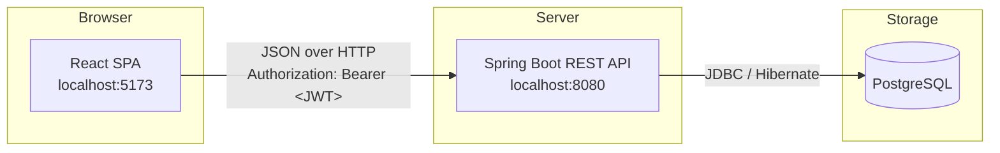
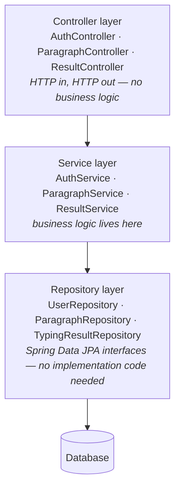
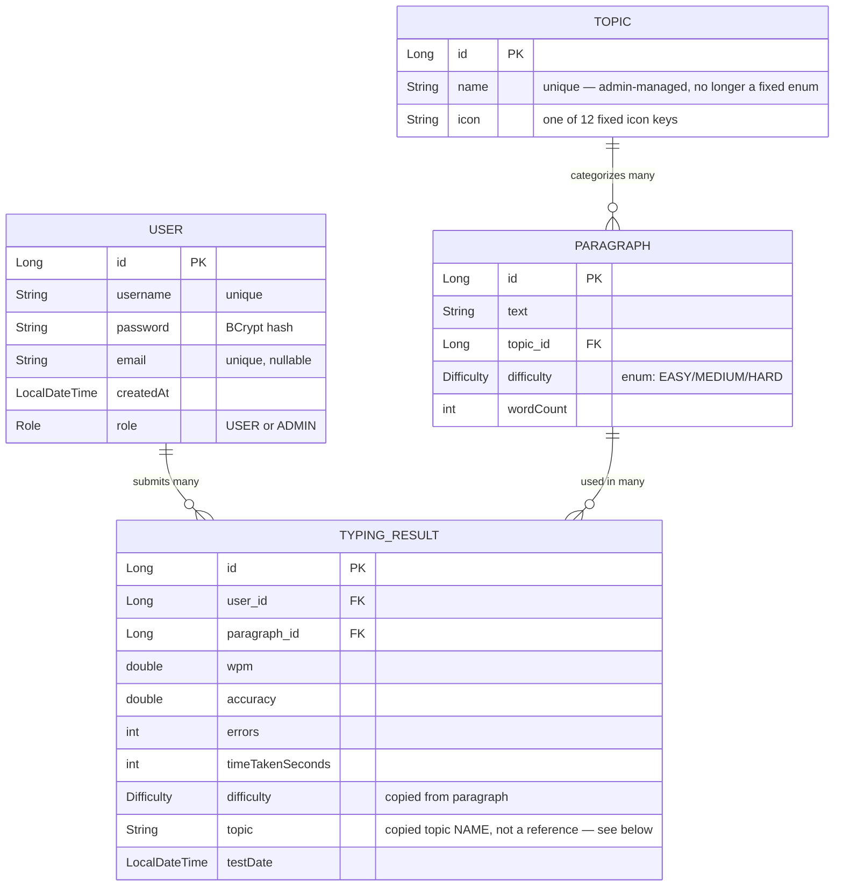
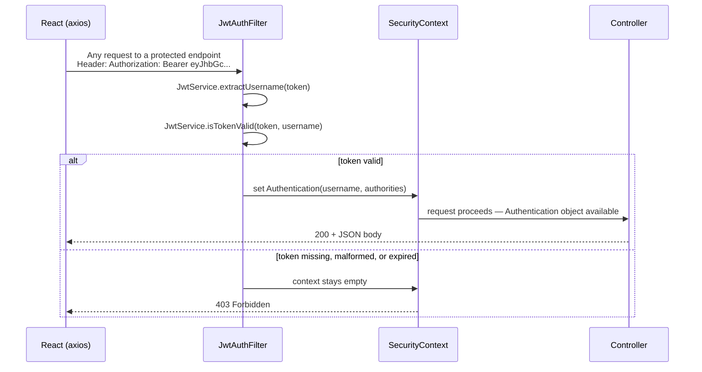
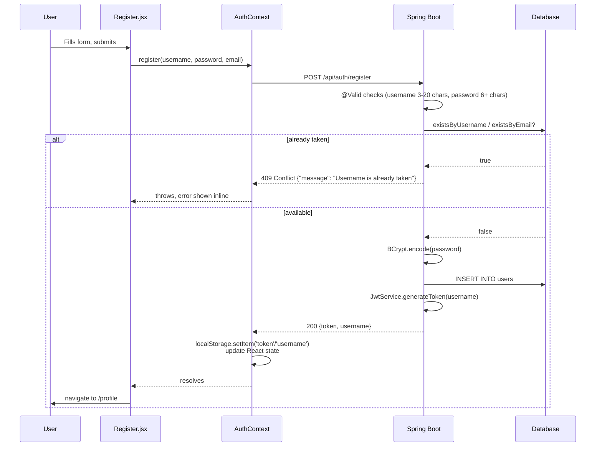
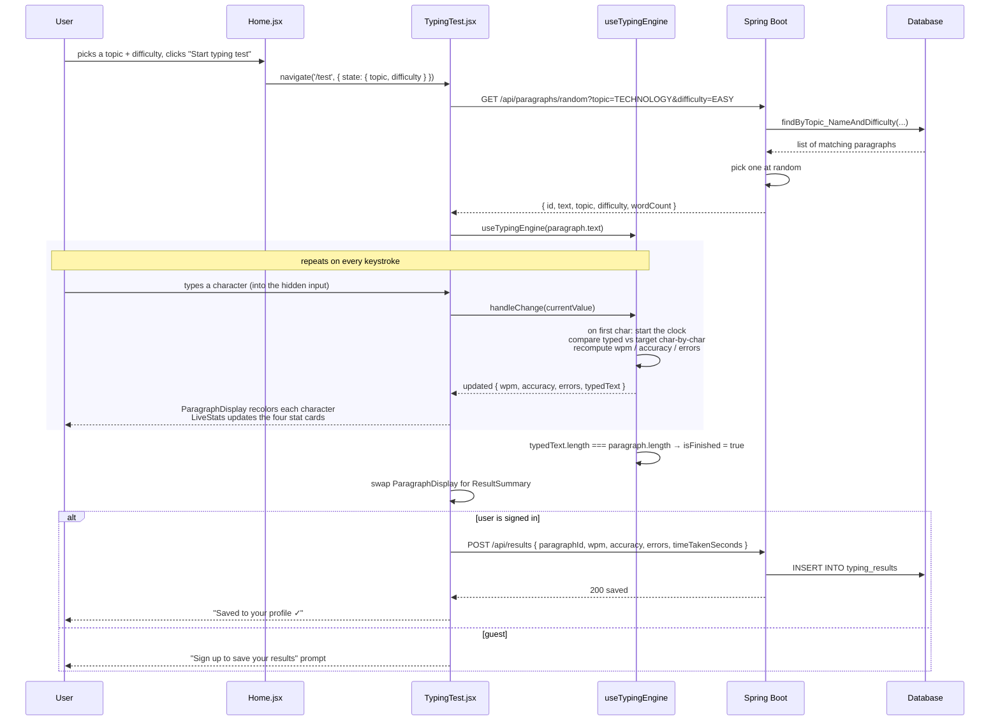
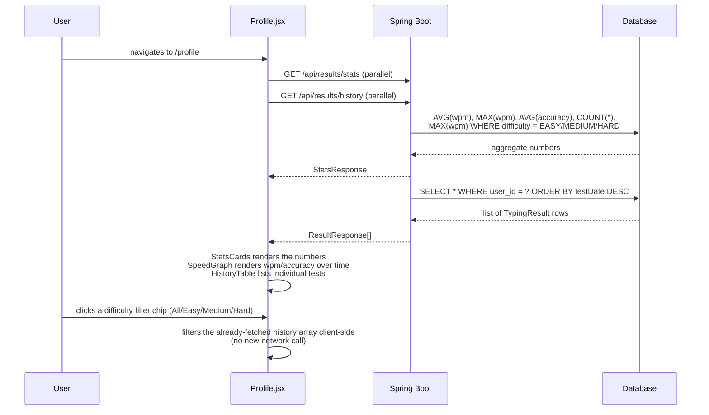

# SpeedType — How the Project Works

A complete walkthrough of the architecture, the pieces that make it up, and exactly
what happens — end to end — for every major action a user takes.

## Table of contents

1. [Overview](#1-overview)
2. [High-level architecture](#2-high-level-architecture)
3. [Backend: layered architecture](#3-backend-layered-architecture)
4. [Database schema](#4-database-schema)
5. [Authentication: how the JWT flow works](#5-authentication-how-the-jwt-flow-works)
6. [Frontend: structure and state](#6-frontend-structure-and-state)
7. [Workflow 1 — Register / Login](#7-workflow-1--register--login)
8. [Workflow 2 — Taking a typing test](#8-workflow-2--taking-a-typing-test)
9. [Workflow 3 — Viewing your profile](#9-workflow-3--viewing-your-profile)
10. [The WPM/accuracy math, worked example](#10-the-wpmaccuracy-math-worked-example)
11. [API reference](#11-api-reference)
12. [Key design decisions (and why)](#12-key-design-decisions-and-why)

---

## 1. Overview

SpeedType is two independent applications that talk to each other over HTTP:

| | |
|---|---|
| **Frontend** | React 18 (plain JS) + Vite, running at `localhost:5173` |
| **Backend** | Spring Boot 3.5 REST API, running at `localhost:8080` |
| **Database** | PostgreSQL |
| **Auth** | Stateless JWT (JSON Web Token), issued by the backend, stored in the browser |

They are **not** one app — the React app is a static site that happens to fetch
data from the Spring Boot API using `fetch`/`axios`. You could deploy the frontend
to Netlify and the backend to a separate server entirely; nothing ties them
together except the API URL configured in `frontend/src/api/client.js`.

---

## 2. High-level architecture



Every arrow from React to Spring Boot is a plain REST call — `GET`/`POST` with a
JSON body, made through `axios` (see `frontend/src/api/`). Every arrow from
Spring Boot to the database goes through **Spring Data JPA**, which turns Java
method calls like `userRepository.findByUsername("alex")` into SQL, and turns
SQL result rows back into Java objects (`User`) — you never write raw SQL
yourself in this project.

---

## 3. Backend: layered architecture

The backend follows a standard **layered architecture** — each layer only talks
to the layer directly below it, which keeps concerns separated and makes each
piece independently testable:



| Package | Responsibility | Example |
|---|---|---|
| `controller/` | Declares REST endpoints (`@GetMapping`, `@PostMapping`), reads the request, calls a service, returns the result. Nothing else. | `AuthController.register()` just calls `authService.register(request)` |
| `service/` | The actual business logic: validation rules, password hashing, computing stats, deciding what counts as an error. | `AuthService.register()` checks for a duplicate username *before* saving |
| `repository/` | One interface per entity, extending `JpaRepository<Entity, Long>`. You declare method signatures like `findByUsername(String)` and Spring Data JPA generates the SQL automatically from the method name. | `boolean existsByUsername(String username);` |
| `model/` | The JPA **entities** — plain Java classes annotated with `@Entity` that map 1:1 to database tables. | `User`, `Paragraph`, `TypingResult` |
| `dto/` | **Data Transfer Objects** — separate classes for what goes *over the wire* (requests/responses), kept deliberately separate from entities so we control exactly what the API exposes (e.g. a `User`'s hashed password is never serialized to JSON, because `AuthResponse` simply doesn't have a `password` field). | `RegisterRequest`, `AuthResponse`, `ResultResponse` |
| `security/` | JWT creation/validation (`JwtService`) and the filter that checks every incoming request for a valid token (`JwtAuthFilter`). | see [Section 5](#5-authentication-how-the-jwt-flow-works) |
| `config/` | Spring configuration beans — currently just `SecurityConfig`, which wires up the whole security filter chain and CORS rules. | |
| `exception/` | `ApiException` (a custom exception carrying an HTTP status) plus `GlobalExceptionHandler`, which catches exceptions thrown *anywhere* in the app and turns them into consistent JSON error responses instead of raw stack traces. | throwing `new ApiException("Username is already taken", HttpStatus.CONFLICT)` anywhere automatically becomes a `409` JSON response |
| `seed/` | `DataSeeder` (topics + starter paragraphs) and `AdminSeeder` (default admin account) — both run once on startup, skipped if their data already exists. | |

**Why entities and DTOs are kept separate:** it's tempting to just return the
`User` entity directly from a controller, but that would leak the hashed
password into every JSON response and tightly couple your API's shape to your
database schema. DTOs decouple "what's in the database" from "what the client
sees."

---

## 4. Database schema



Four tables now. `Topic` used to be a fixed Java enum; it's a real table now so
an admin can add/rename/remove topics at runtime (see `ADMIN_PANEL.md` for the
full story on why and how). `Difficulty` stayed a fixed enum — EASY/MEDIUM/HARD
isn't something that benefits from being open-ended the way topics are.

The interesting detail is that **`TypingResult` duplicates `difficulty` and
`topic`** from the `Paragraph` it references, rather than only relying on the
foreign key — and for `topic` specifically, it stores the **name as plain
text**, not a foreign key to the `Topic` table. This is a deliberate
denormalization:

- **Simpler queries** — stats like "best WPM at HARD difficulty" don't need a
  `JOIN` against the `paragraphs` table, just a `WHERE difficulty = 'HARD'`.
- **Historical accuracy** — if a paragraph's difficulty is edited later, or a
  topic is renamed or even deleted by an admin, past results still read
  correctly instead of pointing at something that no longer exists.

Hibernate creates these tables automatically from the `@Entity` classes in
`model/` (`spring.jpa.hibernate.ddl-auto=update` in `application.properties`) —
there's no separate SQL schema file to maintain.

---

## 5. Authentication: how the JWT flow works

There's no server-side session and no cookie. Every request that needs to know
"who is this user" carries a **JWT (JSON Web Token)** — a signed, self-contained
string — in an `Authorization: Bearer <token>` header. The server verifies the
signature on every request instead of looking up a session in memory or a
database, which is what "stateless" means here.



Concretely, in code:

1. **`JwtAuthFilter`** (`security/JwtAuthFilter.java`) runs on *every single
   request*, before Spring Security's own filters. It reads the `Authorization`
   header; if there's no `Bearer` token, it just passes the request through
   unauthenticated (fine for public endpoints like `/api/paragraphs/random`).
2. If there **is** a token, `JwtService.extractUsername()` decodes it and
   `JwtService.isTokenValid()` checks the signature and expiry.
3. If valid, the filter populates Spring's `SecurityContextHolder` with an
   authenticated principal. From this point on, any controller method can call
   `authentication.getName()` to get the current username — see
   `ResultController`, which uses this for every endpoint.
4. **`SecurityConfig`** (`config/SecurityConfig.java`) declares *which* URLs
   require a valid token at all: `/api/auth/**` and `GET /api/paragraphs/**`
   are open to everyone (`permitAll()`); everything else — including all of
   `/api/results/**` — requires the filter above to have succeeded.

**Where the token comes from in the first place:** `JwtService.generateToken()`
signs a token containing the username and an expiry (24 hours, configurable via
`jwt.expiration-ms`), using a secret key from `application.properties`
(`jwt.secret`). This happens once, at register/login time — see the next
section.

---

## 6. Frontend: structure and state

```
frontend/src/
├── api/            axios calls — one file per backend resource
├── context/         AuthContext.jsx — the one piece of global state (now also carries role)
├── hooks/            useTypingEngine.js — the typing-test logic, extracted from the UI
├── utils/            small formatting helpers (dates, label casing, topic icon lookup)
└── components/
    ├── layout/        Navbar, ProtectedRoute (now supports an adminOnly gate)
    ├── home/           Home (landing + topic/difficulty picker)
    ├── auth/            Login, Register
    ├── typing/           TypingTest + its sub-components
    ├── profile/          Profile + its sub-components
    └── admin/            AdminPanel + ParagraphsTab / TopicsTab — see ADMIN_PANEL.md
```

**State management is deliberately simple** — there's no Redux, no Zustand, no
global store. Just two mechanisms:

- **`AuthContext`** (React Context) — the *only* state that needs to be
  available app-wide: is someone logged in, and as whom. Every component that
  needs to know this calls `useAuth()`.
- **Local component state** (`useState`) — everything else. The current
  paragraph, the typed text, loading/error flags — all of it lives inside the
  component that actually needs it (mostly `TypingTest.jsx` and `Profile.jsx`)
  and disappears when you navigate away. There's no reason for `Home.jsx` to
  know what paragraph you're currently typing.

**Routing** (`react-router-dom`), declared in `App.jsx`:

| Path | Component | Protected? |
|---|---|---|
| `/` | `Home` | No |
| `/test` | `TypingTest` | No (guests can test; only saving requires login) |
| `/login` | `Login` | No |
| `/register` | `Register` | No |
| `/profile` | `Profile` | **Yes** — wrapped in `ProtectedRoute`, which redirects to `/login` if `isAuthenticated` is false |
| `/admin` | `AdminPanel` | **Yes, and ADMIN role** — `ProtectedRoute adminOnly`, redirects non-admins to `/` |

**The typing engine is a custom hook, not a component.** `useTypingEngine.js`
takes the target paragraph text and returns everything a UI needs (`typedText`,
`wpm`, `accuracy`, `errors`, `isFinished`, a `handleChange` function, a `reset`
function) — but it renders nothing itself. `TypingTest.jsx` is the only
component that calls it, then hands the resulting values down as props to
`ParagraphDisplay`, `LiveStats`, and `ResultSummary`. This separation means the
*math* (how WPM is calculated) lives in exactly one place, independent of how
it's displayed.

---

## 7. Workflow 1 — Register / Login



Login is the same shape, minus the "create a row" step — `AuthService.login()`
delegates the actual password check to Spring Security's
`AuthenticationManager`, which uses `CustomUserDetailsService` to load the
user and `PasswordEncoder.matches()` to compare the submitted password against
the stored BCrypt hash. A wrong password throws `BadCredentialsException`,
which `GlobalExceptionHandler` turns into a `401`.

From here on, **every** request the frontend makes automatically carries the
token — see `api/client.js`: an axios *request interceptor* reads
`localStorage.getItem('token')` and adds the `Authorization` header to every
outgoing call, so individual API functions (`fetchHistory()`, `submitResult()`,
etc.) never have to think about auth at all.

---

## 8. Workflow 2 — Taking a typing test

This is the core interaction, and the one with the most moving parts.



A few details worth calling out:

- **The paragraph is fetched once per attempt**, not re-fetched on every
  keystroke — `TypingTest.jsx` calls `loadParagraph()` on mount, and again only
  when you click "New paragraph." Typing itself never touches the network.
- **`useTypingEngine` resets automatically** whenever the paragraph text
  changes (a `useEffect` watching `paragraphText`), so fetching a new
  paragraph and clicking "Try again" (same paragraph) both correctly clear
  `typedText`/timer state without the two code paths interfering with each
  other.
- **Saving is fire-and-forget from the user's point of view** — the moment
  `isFinished` flips to `true`, a `useEffect` in `TypingTest.jsx` posts the
  result automatically. There's no "Save" button to click and forget.
- **Guests can take the entire test.** Only the final `POST /api/results` call
  is gated on `isAuthenticated` — the paragraph endpoint is `permitAll()` in
  `SecurityConfig`, by design, so trying the product has zero friction.

---

## 9. Workflow 3 — Viewing your profile



Two things worth understanding here:

1. **The stats (`averageWpm`, `bestWpm`, etc.) are computed in the database**,
   not in Java or JavaScript — `TypingResultRepository` has methods like
   `findAverageWpmByUserId()` backed by a JPQL query (`SELECT AVG(t.wpm) FROM
   TypingResult t WHERE t.user.id = :userId`). This is far cheaper than pulling
   every row back and averaging in application code, especially as history
   grows.
2. **The difficulty filter is entirely client-side.** `Profile.jsx` fetches
   the *full* history once, then `useMemo` filters the already-in-memory array
   whenever you click a filter chip. This trades a small amount of extra data
   transferred up front for zero additional network round-trips while you're
   exploring your own history.

---

## 10. The WPM/accuracy math, worked example

All of this lives in `frontend/src/hooks/useTypingEngine.js`, and it's plain
arithmetic — no library involved. Walking through one concrete example:

> You're given a 25-character paragraph. You type all 25 characters correctly
> except one mistake, in 15 seconds.

- **Correct characters** = `typedText.length - errors` = `25 - 1` = `24`
- **Minutes elapsed** = `15 / 60` = `0.25`
- **WPM** = `(correctChars / 5) / minutes` = `(24 / 5) / 0.25` = `4.8 / 0.25` =
  **19.2 → rounds to 19**
  *(the "divide by 5" is the standard typing-test convention: one "word" =
  five characters, regardless of actual word length, so WPM is comparable
  across different texts)*
- **Accuracy** = `(correctChars / typedText.length) × 100` = `(24 / 25) × 100`
  = **96%**

Note this uses **correct** characters, not total characters typed — so
backspacing to fix a mistake before finishing raises your WPM (fewer errors
counted at the end) rather than being penalized twice. `errors` itself is
computed fresh on every keystroke by comparing `typedText[i]` against the
target paragraph's `text[i]` for every index — it's a live mismatch count, not
a running tally of every keystroke ever made.

---

## 11. API reference

| Method | Endpoint | Auth required | Request body | Returns |
|---|---|---|---|---|
| `POST` | `/api/auth/register` | No | `{username, password, email?}` | `{token, username}` |
| `POST` | `/api/auth/login` | No | `{username, password}` | `{token, username}` |
| `GET` | `/api/paragraphs/topics` | No | — | `[{id, name, icon}, ...]` |
| `GET` | `/api/paragraphs/random?topic=&difficulty=` | No | — | `{id, text, topic, difficulty, wordCount}` |

Admin CRUD endpoints (`/api/admin/paragraphs`, `/api/admin/topics`) aren't
listed here — they're a big enough addition to get their own document, see
[ADMIN_PANEL.md](./ADMIN_PANEL.md).
| `POST` | `/api/results` | **Yes** | `{paragraphId, wpm, accuracy, errors, timeTakenSeconds}` | saved result |
| `GET` | `/api/results/history` | **Yes** | — | array of results, newest first |
| `GET` | `/api/results/stats` | **Yes** | — | `{averageWpm, bestWpm, averageAccuracy, totalTests, bestWpmEasy, bestWpmMedium, bestWpmHard}` |

"Auth required" means the request needs an `Authorization: Bearer <token>`
header, obtained from the register/login response.

---

## 12. Key design decisions (and why)

A few choices in this project aren't the *only* correct way to build it — worth
understanding the trade-off:

- **Spring Boot 3.5, not 4.x.** Spring Boot 4 shipped in late 2025 with real
  breaking changes (renamed starters, Jackson 3, stricter Security defaults).
  3.5 is the far more thoroughly documented line right now, which matters more
  than being on the newest version for a project you're actively learning
  from and debugging.
- **Plain Java, no Lombok.** The project originally used Lombok
  (`@Data`/`@Builder`/etc.) for shorter entity/DTO classes, but that requires
  an annotation-processing step in the build that turned out to be
  environment-sensitive — it silently didn't run in one Maven setup, causing
  a wall of "cannot find symbol" errors for methods that were supposed to be
  generated. Explicit getters/setters/constructors are more lines of code,
  but there's no build-time magic that can silently fail.
- **PostgreSQL, via Spring Data JPA.** JPA/Hibernate means the entity and
  repository code has no database-specific SQL in it — everything goes through
  `JpaRepository` methods and JPQL. That's what makes the earlier database
  switch (originally H2 by default, MySQL/Postgres as opt-in profiles) a
  one-file config change rather than a rewrite.
- **JWT in `localStorage`, not an httpOnly cookie.** Simpler to implement and
  fine for a learning project; a production app handling sensitive data would
  typically prefer httpOnly cookies to reduce exposure to XSS attacks stealing
  the token.
- **Denormalized `topic`/`difficulty` on `TypingResult`.** Covered in
  [Section 4](#4-database-schema) — trades a little redundancy for simpler
  queries and historically-accurate stats.
- **The "keycap" visual language.** The brief asked for candy colors that stay
  easy on the eyes. Rather than a generic pastel template, buttons/chips/
  toggles use a consistent soft-bevel, press-down interaction — a nod to
  pastel mechanical keyboards, since this is, after all, a typing app.
